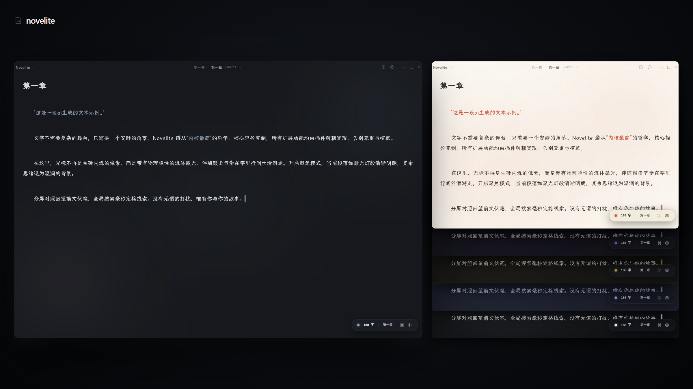
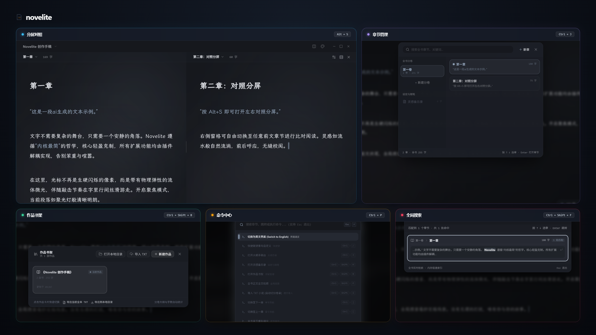

<div align="center">


# Novelite

**轻量内核 · 极简外观 · 插件化架构的现代小说文本编辑器**

[](./LICENSE)
[](https://github.com/hirovel/novelite/releases)

[简体中文](./README.md) · [English](./README_EN.md)

<br />



</div>

---

为了自己写小说的体验，制作了 Novelite，希望简洁的外观和丝滑的光标能带来愉悦的编辑体验。

根据**内核最简**的原则设计，核心保持轻量，扩展功能均由插件解耦实现。

### 目前已经实现的功能



<br />

- **流体光标**
  
  

- **聚焦模式**：高亮编辑段落，暗淡其他
- **微光背景**
- **分屏对照**
- **快捷搜索词汇**
- **章节管理**
- **快捷键设置，命令中心**

---

### 安装和运行

#### Windows 桌面客户端

前往 [Releases](https://github.com/hirovel/novelite/releases/latest) 下载 `Novelite-Setup.exe` 或绿色便携版。

#### 通过 Node.js (v18+) 一行运行

```bash
npx novelite
```

---

### 协议与版权

GNU General Public License v3.0 (GPL-3.0)
