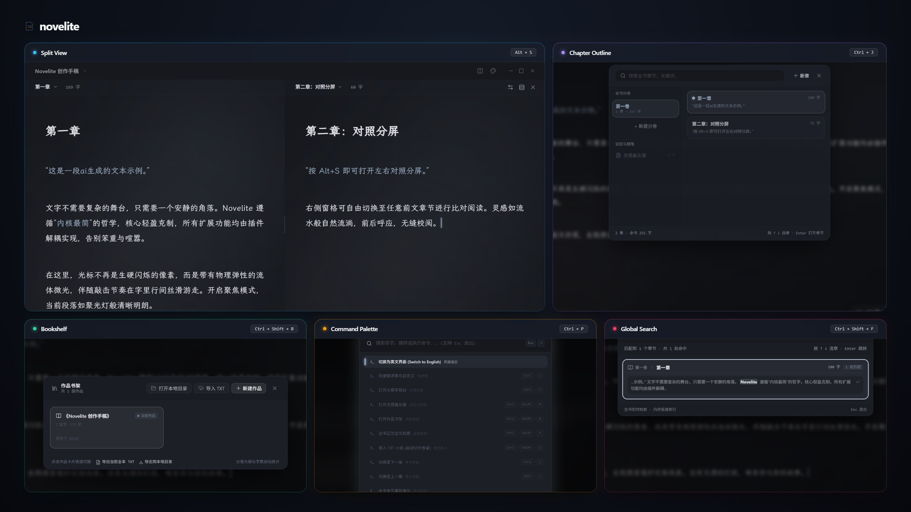

<div align="center">


# Novelite

**A minimal desktop novel editor with lightweight core, clean aesthetics, and plugin-driven architecture.**

[](./LICENSE)
[](https://github.com/hirovel/novelite/releases)

[简体中文](./README.md) · [English](./README_EN.md)

<br />


</div>

---

Crafted to enhance personal novel writing, Novelite pairs a clean visual aesthetic with a buttery-smooth cursor for an enjoyable writing experience.

Designed with a **minimal core** principle, the foundation remains lightweight while extended features are decoupled via plugins.

### Currently Implemented Features



<br />

- **Fluid Cursor**
  
  

- **Focus Mode**: Highlights active paragraph, dims others
- **Ambient Background**
- **Split View Reference**
- **Quick Vocabulary Search**
- **Chapter Management**
- **Keymap Settings & Command Center**

---

### Installation & Run

#### Windows Desktop Client

Download `Novelite-Setup.exe` or portable release from [Releases](https://github.com/hirovel/novelite/releases/latest).

#### Instant Run via Node.js (v18+)

```bash
npx novelite
```

---

### License & Copyright

GNU General Public License v3.0 (GPL-3.0)
